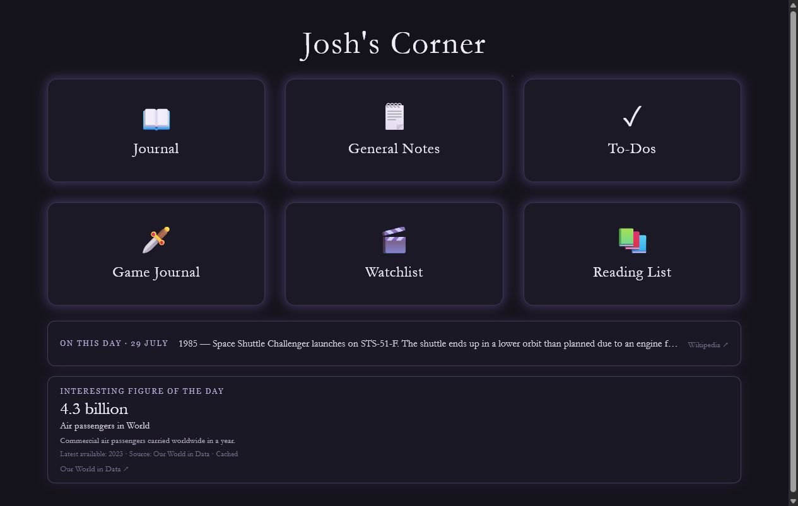
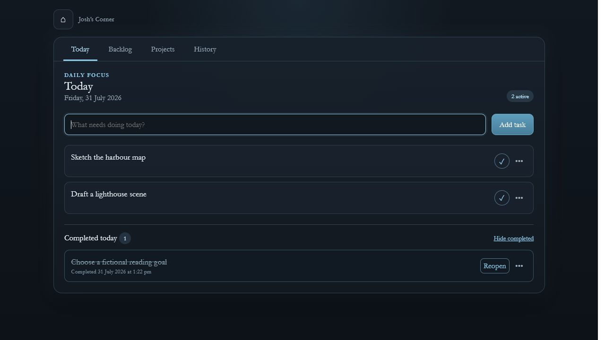
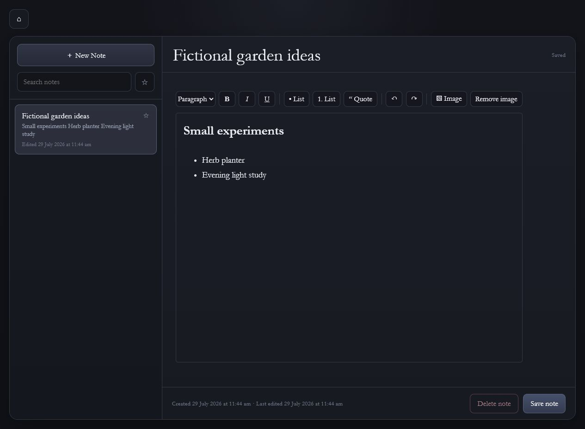
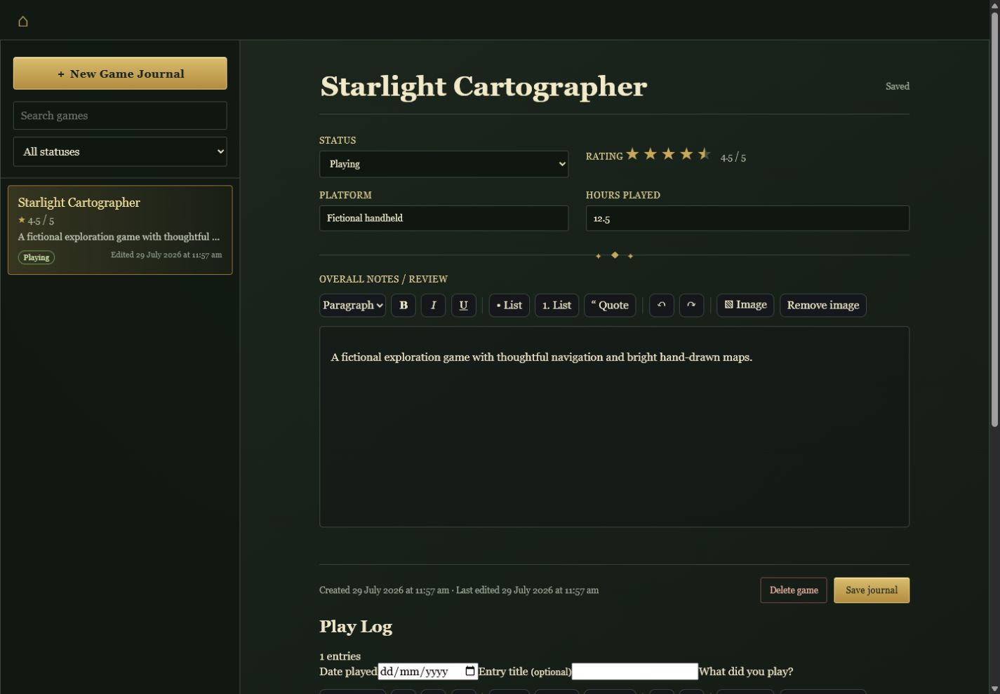
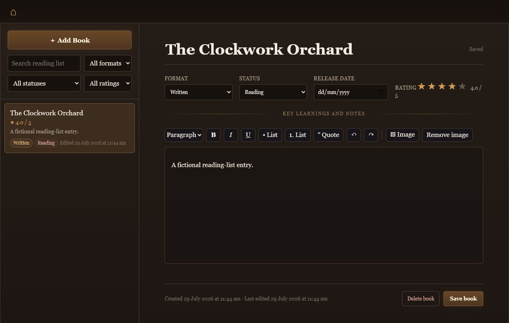
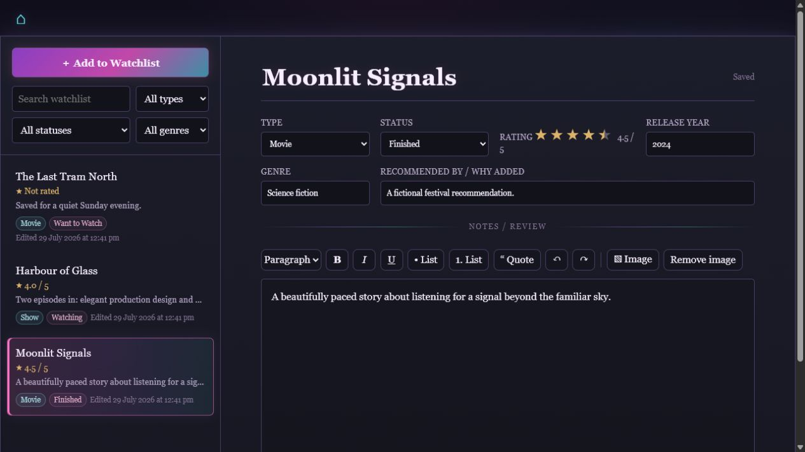

# Josh's Corner

Josh's Corner is a local-first personal organiser for Windows. It combines a journal, notes, tasks, game play logs, watchlist, reading list, rich text, local image attachments, and daily historical/statistical panels in one private app at `http://127.0.0.1:5000`.

It is also a product-thinking portfolio project: requirements were defined in small, reviewable stages; approved visual prototypes guided interface decisions; and each addition was checked against usability, privacy, data safety, maintainability, and regression risk rather than treated as an isolated coding exercise.

## Product tour

**Unified personal dashboard** — six focused areas alongside local-first daily context.



<table>
  <tr>
    <td width="50%" valign="top">
      <strong>Journal</strong><br>
      Dated journalling through a monthly calendar and a focused entry editor.<br><br>
      
    </td>
    <td width="50%" valign="top">
      <strong>To-Dos</strong><br>
      Clear active-task planning with completed work retained in an accessible history.<br><br>
      
    </td>
  </tr>
  <tr>
    <td width="50%" valign="top">
      <strong>General Notes</strong><br>
      Searchable, favouritable rich-text knowledge capture for everyday reference.<br><br>
      
    </td>
    <td width="50%" valign="top">
      <strong>Game Journal and Play Log</strong><br>
      Game-level reviews, ratings, and dated play-session reflections in one view.<br><br>
      
    </td>
  </tr>
  <tr>
    <td width="50%" valign="top">
      <strong>Reading List</strong><br>
      Structured reading tracking with ratings, status, and review insights.<br><br>
      
    </td>
    <td width="50%" valign="top">
      <strong>Watchlist</strong><br>
      Structured movie and show tracking with filters, ratings, recommendation context, and rich reviews.<br><br>
      
    </td>
  </tr>
</table>

## Features

- Journal calendar with one entry per date and historical reminders
- Searchable, favouritable General Notes
- Active and archived To-Dos
- Game Journal with ratings, status, platform, hours, and dated Play Logs
- Watchlist and Reading List with filters and rich reviews
- Shared rich-text editors with local PNG, JPEG, and WebP image support
- Cached Wikipedia historical events and multi-source daily figures
- Top-level Automation Centre with tracker, alert, and local run-history foundations
- Manual Flight Tracker with a credential-gated, documented provider adapter (no background checks)
- SQLite migrations, validated backup packages, safe separate restore, and optional Windows startup automation

## Privacy by design

The app is designed for one local user. It binds only to `127.0.0.1`, stores data in local SQLite and upload folders, and does not require an account, cloud database, or public deployment. Runtime databases, uploads, backup packages, caches, logs, and local configuration are excluded from Git.

## Stack and architecture

Python · Flask · SQLite · SQLAlchemy · Alembic · Jinja · vanilla JavaScript and CSS · Pillow · pytest.

Flask blueprints organise feature areas; SQLAlchemy models and Alembic migrations manage persistence; shared templates and browser code provide the interface. Daily-data services cache network results and fall back safely offline. Attachments are validated by content, auto-rotated, capped at 10 MB input / 2560 px, and stored locally as WebP or transparent PNG.

The delivery approach deliberately balanced user flow and visual refinement with practical resilience: scoped stages, prototype comparison, migration discipline, automated tests, local backup/restore checks, and explicit separation between live data and test or demo data.

New backups are ZIP packages containing a validated SQLite copy, matching uploads, a manifest, and SHA-256 checksums. Older database-only backups remain restorable but do not contain later image files.

## Clean Windows setup

1. Install [Python 3.12+](https://www.python.org/downloads/windows/) and add it to PATH.
2. Clone the repository and open PowerShell in the clone.
3. Create a virtual environment and install dependencies:

   ```powershell
   py -3.12 -m venv .venv
   .\.venv\Scripts\Activate.ps1
   python -m pip install -r requirements.txt
   ```

4. Create the empty local database and run the app:

   ```powershell
   python -m flask --app run.py db upgrade
   python run.py
   ```

5. Open `http://127.0.0.1:5000` locally. Run checks with:

   ```powershell
   python -m pytest -q
   python -m compileall app scripts
   ```

The project currently has **215 automated tests**. A clone starts without any personal database, uploads, backups, or local settings.

Flight Tracker provider setup is optional and local-only; see [the provider foundation notes](docs/flight_tracking.md). Without legitimate local credentials, it performs no network request.

## Local operations

```powershell
.\.venv\Scripts\python.exe scripts\backup_database.py
.\.venv\Scripts\python.exe scripts\attachment_diagnostics.py
.\.venv\Scripts\python.exe scripts\restore_database.py path\to\backup.zip --target restore.test.db
```

Restores target a separate location by default. CSRF protection is enabled for POST actions, but this is not an internet-facing application: do not expose Flask's development server publicly.

## Screenshots

Fictional, non-private screenshots are in [`docs/screenshots`](docs/screenshots/). They use a temporary demo database only; no live data, uploaded image, desktop content, local path, or personal name is shown.

## Limitations and future ideas

Josh's Corner is intentionally local-only and has no multi-user authentication. Orphan-image diagnostics report candidates but never automatically delete uncertain files. Possible future directions include export/import, encrypted backups, and richer media metadata.

## Development acknowledgement

Requirements, product direction, review, and testing were human-led. Implementation was developed with assistance from OpenAI Codex; the repository does not claim every line was manually authored.
